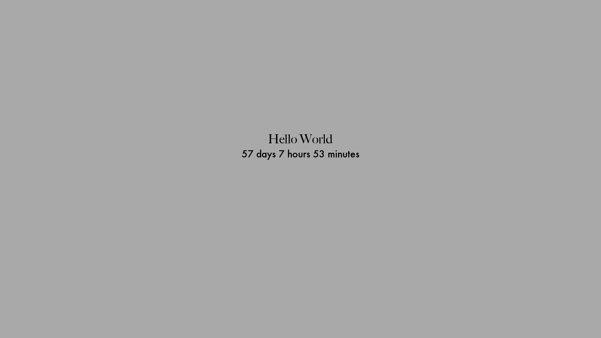

# Wallpaper Countdown Project

This project generates dynamic wallpapers showing a countdown to a specific date. It serves as a reminder of your goals and the time remaining to achieve them, directly on your desktop.

## Description

I created this tool to provide a continuous, visual reminder of an upcoming significant event. It's a constant motivator, ensuring that every glance at the desktop reminds me of the days, hours, and minutes left to my target date.

#### Plain Background Example



#### Custom Background Example


## Features

  - **Dynamic Wallpaper Generation**: This feature allows for the automatic generation of wallpapers with an updated countdown.
  
  - **Automatic Updates**: With the integration of macOS's `launchd`, the wallpaper can be refreshed at defined intervals, ensuring the countdown is always accurate.

  - **Logging**: The system keeps logs of every wallpaper update, ensuring that any issues can be quickly identified and addressed.

## Setup Steps

### 1. **Prerequisites**:
  - Clone the repository and navigate to the main project directory:

  ```
  git clone https://github.com/anthonyb8/CountdownWallpaper.git
  cd CountdownWallpaper
  ```

  - Install the required packages:
  ```
  pip install -r requirements.txt
  ```
### 2. **Environment Setup**:

  - Create a `.env` file following the example provided in the [ENV-Template](ENV-template.txt) file.

### 3. **Run the Script**:

  This will initialize the necessary configurations and create the plist file.

  ```
  python src/main.py
  ```

### 4. **Automatic Wallpaper Update**:
  #### 1. Transfer the `com.<yourname>.wallpaper_countdown.plist` from the `launch_agents` directory to   `~/Library/LaunchAgents/`:

  ```
  cp launch_agents/com.<yourname>.wallpaper_countdown.plist ~/Library/LaunchAgents/
  ```
  #### 2. Set the appropriate permissions for the plist file:

  ```
  chmod 644 ~/Library/LaunchAgents/com.<yourname>.wallpaper_countdown.plist
  ```

  #### 3. Activate the plist with `launchd`:

  ```
  launchctl bootstrap gui/$(id -u) ~/Library/LaunchAgents/com.<yourname>.wallpaper_countdown.plist
  ```
  
### 5. **Verification Steps**:

To ensure everything is set up correctly, follow these verification steps:

  #### 1. Check if the service is loaded:

  List all services and filter by the name of your service:

  ```
  launchctl list | grep com.<yourname>.wallpaper_countdown
  ```

  #### 2. Verify the `plist` copy:

  Ensure that the `plist` has been copied to the `~/Library/LaunchAgents/` directory:

  ```
  ls ~/Library/LaunchAgents/ | grep com.<yourname>.wallpaper_countdown.plist
  ```

  #### 3. Examine Output and Error Logs:

  If your `plist` specifies paths for `StandardOutPath` and `StandardErrorPath`, inspect these files for outputs or errors:

  ```
  cat /path/to/your/StandardOutPath.log
  cat /path/to/your/StandardErrorPath.log
  ```

Replace `/path/to/your/` with the actual paths specified in your `plist`.

## Technologies

- Python 3.8.8
- PIL (Python Imaging Library)
- macOS (Tested on macOS Ventura)

## License
MIT License
